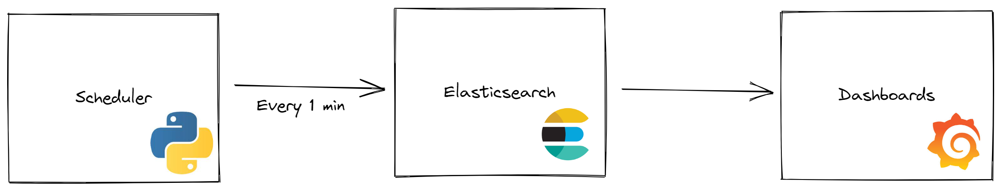

# PC Monitoring

This project was made to understand and discover how to work with [Grafana](https://grafana.com) and [Elasticsearch](https://www.elastic.co/pt/what-is/elasticsearch). The idea of this application is to monitor your RAM, Disk and Battery information as cronjob and send the obtained data to an instance of a Elasticsearch, from there send the information to Grafana and show as dashboards.

